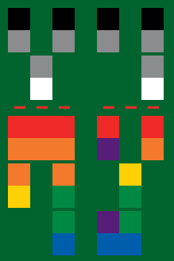

# xygen

[Coldplay X&Y album art](https://en.wikipedia.org/wiki/X&Y) generator

[Demo](https://kenrick95.github.io/xygen/index.html)

## Compatibility

Modern browser is required. Only tested on Firefox 65.

Because this project is written in totally Vanilla JS (ES2015+).

## Idea

Input text, encode as [Baudot code](https://en.wikipedia.org/wiki/Baudot_code), in Coldplay's X&Y style.

Coldplay X&Y album booklet includes a page where they provide the mapping ([ref](https://themostorganicdesign.files.wordpress.com/2013/10/coldplay-x-y-41.jpg)). This looks similar enough to "ITA2" standard, with some weirdness in the special characters.

Similar project:

- [Coldcode](http://ditonus.com/coldcode/)

## License

MIT License

## Example

